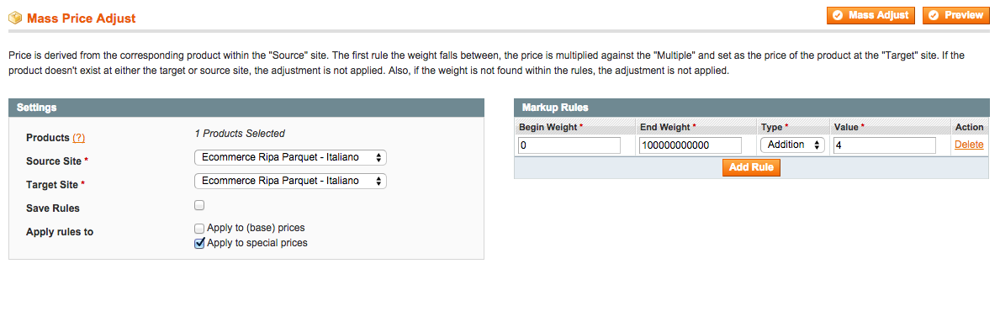

# Magento PriceAdjust
 
PriceAdjust is an advanced Magento tool for mass updating product prices using custom rules.

## Features

- Select individual or all products for a given store.
- Create one or more rules that apply the chosen type of arithmetic to the products price based on a weight range.
- Current arithmetic types are `Multiply`, `Addition`, `Subtract` and `Divide`
- Ability to save rules for repeat mass price adjustments.
- Advanced ability of choosing a `Source` store for the products price and then applying the rules to a `Target` store.
- Can preview selected products proposed price adjustments before committing to the mass adjustment
- Ability to apply same rules to both prices and special prices or only special prices;

## Getting Started

After installation, to get started with PriceAdjust:

1. Login to Magento Admin Panel.
2. Go to `Catalog`, `Manage Products`.
3. Select individual products or `Select All`.
4. Choose `Price Adjust` from `Actions` drop-down and click `Submit`.
5. From here, rules can be added based on weight. If simple increase or decrease of product prices is desired for all selected products, set `Begin Weight` to `0` and `End Weight` to a large number. From there, the type of arithmetic can be chosen. 
6. Be sure to `Preview` the adjustment before committing and clicking `Mass Adjust`.
7. If Magento installation has multiple stores, be mindful of which `Source` and `Target` store is selected.

Important: It is recommended and best practice to backup your database before performing any mass action in a production environment. 

## Version 0.1.0

This is release version 0.1.0 of [PriceAdjust](https://github.com/morgan/magento-priceadjust).
